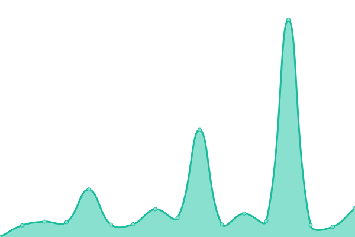
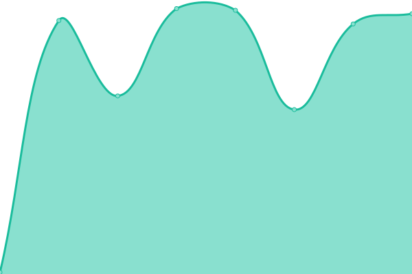
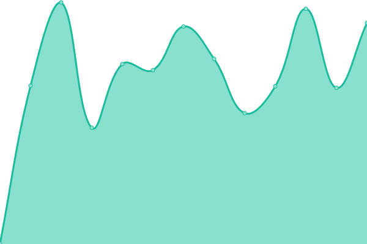

# [📈 Live Status](https://status.casa-carreras.es): <!--live status--> **🟧 Partial outage**

This repository contains the open-source uptime monitor and status page for [Bellas Artes Casa Carreras](https://status.casa-carreras.es), powered by [Upptime](https://github.com/upptime/upptime).

With [Upptime](https://upptime.js.org), you can get your own unlimited and free uptime monitor and status page, powered entirely by a GitHub repository. We use [Issues](https://github.com/Bellas Artes Casa Carreras/status/issues) as incident reports, [Actions](https://github.com/Bellas Artes Casa Carreras/status/actions) as uptime monitors, and [Pages](https://status.casa-carreras.es) for the status page.

<!--start: status pages-->
<!-- This summary is generated by Upptime (https://github.com/upptime/upptime) -->
<!-- Do not edit this manually, your changes will be overwritten -->
<!-- prettier-ignore -->
| URL | Status | History | Response Time | Uptime |
| --- | ------ | ------- | ------------- | ------ |
|  [Shop](https://casa-carreras.es) | 🟥 Down | [shop.yml](https://github.com/casa-carreras/status/commits/HEAD/history/shop.yml) | 

 2346ms
     
 | 

<a href="https://status.casa-carreras.es/history/shop">100.00%</a>
    

|  [Mail](mail.casa-carreras.es) | 🟥 Down | [mail.yml](https://github.com/casa-carreras/status/commits/HEAD/history/mail.yml) | 

 117ms
     
 | 

<a href="https://status.casa-carreras.es/history/mail">100.00%</a>
    

|  [Webmail](https://webmail.casa-carreras.es) | 🟥 Down | [webmail.yml](https://github.com/casa-carreras/status/commits/HEAD/history/webmail.yml) | 

 579ms
     
 | 

<a href="https://status.casa-carreras.es/history/webmail">100.00%</a>
    

|  [Backups](https://backup.casa-carreras.es) | 🟥 Down | [backups.yml](https://github.com/casa-carreras/status/commits/HEAD/history/backups.yml) | 

 356ms
     
 | 

<a href="https://status.casa-carreras.es/history/backups">100.00%</a>
    

|  [VPN](https://vpn.casa-carreras.es) | 🟩 Up | [vpn.yml](https://github.com/casa-carreras/status/commits/HEAD/history/vpn.yml) | 

 623ms
     
 | 

<a href="https://status.casa-carreras.es/history/vpn">100.00%</a>
    

<!--end: status pages-->

[**Visit our status website →**](https://status.casa-carreras.es)

## 📄 License

- Powered by: [Upptime](https://github.com/upptime/upptime)
- Code: [MIT](./LICENSE) © [Anand Chowdhary](https://anandchowdhary.com), supported by [Pabio](https://pabio.com)
- Data in the `./history` directory: [Open Database License](https://opendatacommons.org/licenses/odbl/1-0/)
